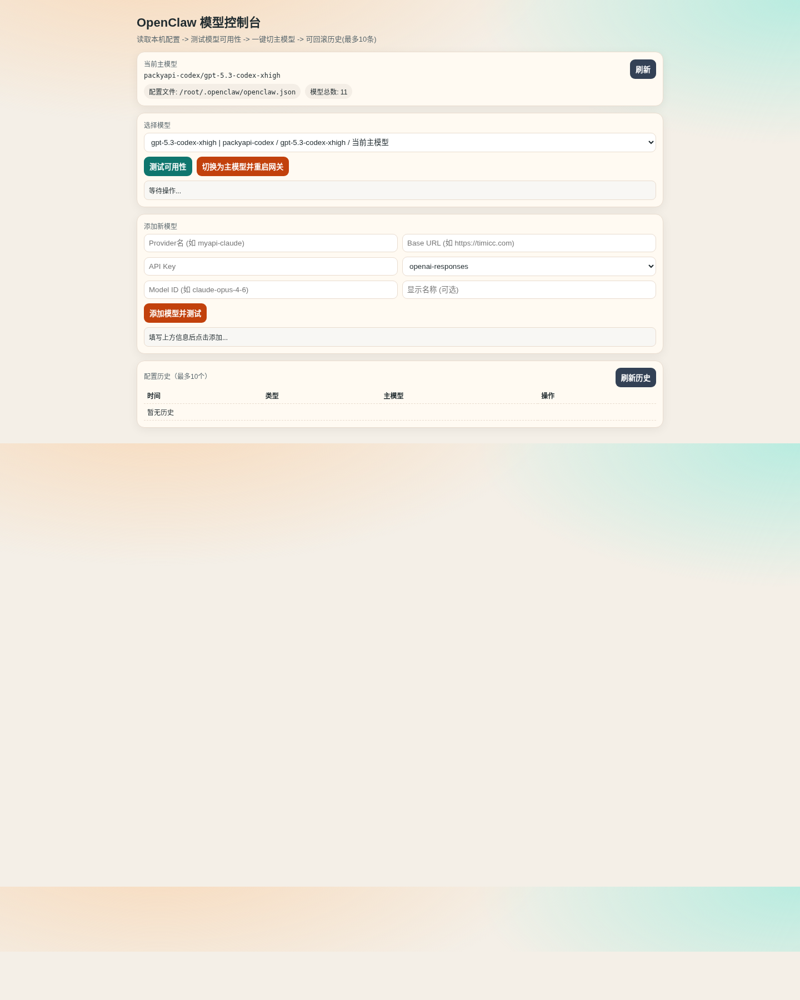

# OpenClaw Model Console（开源版）

一个可本地部署、可手机访问的 OpenClaw 模型控制台。

它会直接读取你本机的 OpenClaw 配置文件，提供：

- 模型列表浏览（按 provider/model 展示）
- 模型可用性测试（对话测试“你好”）
- 一键切换主模型（primary）
- 历史版本快照（最多保留 10 条）
- 一键回滚历史配置
- 新模型添加（添加后自动测试格式与可用性）
- 删除模型（自动处理 primary/fallback 并重启）

> 说明：本仓库为“开源脱敏版”，不包含任何真实密钥、历史快照或个人配置。

## 界面截图




## 1. 功能清单

### 1.1 自动读取配置
- 默认读取：`/root/.openclaw/openclaw.json`
- 可通过环境变量 `OPENCLAW_CONFIG` 覆盖

### 1.2 模型可用性测试
点击“测试可用性”会发起真实调用：

- 测试提示词：`你好`
- `openai-responses`：调用 `POST /responses`
- `anthropic-messages`：调用 `POST /v1/messages`
- 验证项：
  - HTTP 状态码是否 2xx
  - 响应是否为合法 JSON
  - 提取到的文本内容是否非空

### 1.3 切换主模型
- 修改 `agents.defaults.model.primary`
- 自动把旧主模型写入 fallback（去重）
- 切换前自动保存快照
- 切换后自动执行 `openclaw gateway restart`

### 1.4 历史版本管理（最多10条）
- 历史路径：`data/history/*.json`
- 切换前、恢复前、添加模型前都会留快照
- 自动删除旧快照，仅保留最近 10 条

### 1.5 添加模型（含格式校验与可用性验证）
支持在 UI 输入：
- Provider 名
- Base URL
- API Key
- API 类型（`openai-responses` / `anthropic-messages`）
- Model ID / Model Name

提交后会：
1. 参数校验（必填、api 类型合法）
2. 写入配置
3. 立即调用测试接口验证格式和可用性


### 1.6 删除模型
- 可删除当前所选 `provider/model`
- 删除前自动保存快照
- 如果删除的是当前 primary，会自动切换到可用模型
- 自动清理失效 fallback
- 删除后自动执行 `openclaw gateway restart`

---

## 2. 项目结构

```text
openclaw-model-console-oss/
├─ server.js                # Node.js 后端（无外部依赖）
├─ public/
│  └─ index.html            # 前端单页
├─ data/
│  └─ history/              # 运行时历史快照（默认空）
├─ .gitignore
├─ LICENSE
└─ README.md
```

---

## 3. 部署方式

### 3.1 环境要求
- Linux / macOS
- Node.js >= 18
- 已安装并可执行 `openclaw` 命令（用于重启 gateway）

### 3.2 启动

```bash
node server.js
```

默认监听：`0.0.0.0:3939`

浏览器访问：
- 本机：`http://127.0.0.1:3939`
- 手机（同局域网）：`http://<服务器IP>:3939`

### 3.3 可选环境变量

```bash
export MODEL_CONSOLE_HOST=0.0.0.0
export MODEL_CONSOLE_PORT=3939
export OPENCLAW_CONFIG=/root/.openclaw/openclaw.json
node server.js
```

---

## 4. API 说明

### `GET /api/status`
返回当前配置路径、主模型、模型列表。

### `POST /api/test-model`
请求体：

```json
{
  "provider": "myapi-claude",
  "modelId": "claude-opus-4-6"
}
```

### `POST /api/switch-model`
请求体：

```json
{
  "full": "myapi-claude/claude-opus-4-6"
}
```

### `GET /api/history`
返回历史快照列表。

### `POST /api/restore`
请求体：

```json
{
  "id": "2026-02-21T10-31-16-012Z_ea3c3aa9"
}
```

### `POST /api/add-model`
请求体：

```json
{
  "providerName": "myapi-openai",
  "baseUrl": "https://your-api.example.com/v1",
  "apiKey": "sk-xxxx",
  "api": "openai-responses",
  "modelId": "gpt-4.1-mini",
  "modelName": "GPT-4.1 Mini"
}
```

### `POST /api/delete-model`
请求体：

```json
{
  "full": "myapi-openai/gpt-4.1-mini"
}
```


---

## 5. 安全说明（必读）

1. 该项目会读取并写入 OpenClaw 主配置，请确保仅授权可信用户访问。
2. 建议把 3939 端口限制在内网，不要直接暴露公网。
3. 历史快照可能包含敏感字段（如 API Key），默认写在本地 `data/history`，请做好磁盘权限控制。
4. 如果计划公网访问，务必加反向代理 + HTTPS + 认证层。

---

## 6. 常见问题

### Q1：页面能打开但模型测试失败
- 检查 `baseUrl` 是否可达
- 检查 `apiKey` 是否有效
- 检查 `api` 类型与上游接口是否匹配

### Q2：切换模型后没有生效
- 确认 `openclaw gateway restart` 能在系统中执行
- 查看 OpenClaw 日志是否有加载错误

### Q3：手机访问不到
- 确认服务器防火墙开放了 3939
- 确认手机和服务器在同一网络
- 确认监听地址是 `0.0.0.0`

---

## 7. 开源许可

MIT
